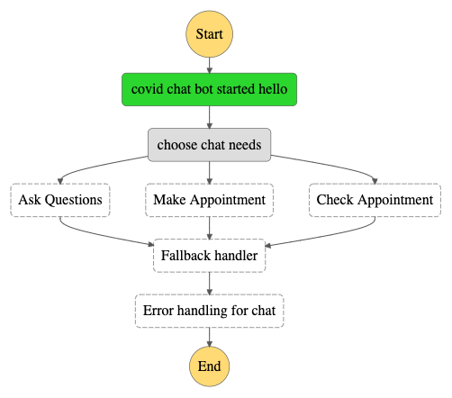
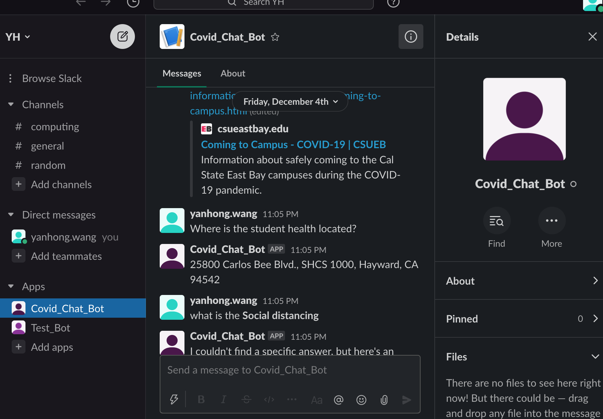

# student-covid-Chatbot
CSUEB student covid information chatbot

### What this chatbot achieve: 
* Make an appointment with CSUEB health center for flu shots, fever, or headache.  
* Check the appointment 
* Ask a question:  
        1: covid related campus policies
        2: ggeneral covid questions 
        

### Using AWS resource: 
1. AWS Lex
2. AWS kendra
3. AWS Lambda 
4. S3

### File
1. *covid_bot_lambda_handler.zip*: python function add to lambda 
2. *covid_bot.zip*: json file add to lex
3. *covid-faq.csv* , *covid-glossary*, *covid-medical-info*: document store in S3. 
4. *stepFunction.json*: diagram flow on step funciton 
5: *Project Report_Main*: project report 

### Structure

* Please check the **Project Report_Main** file and follow the detailed steps.  

### Visual
